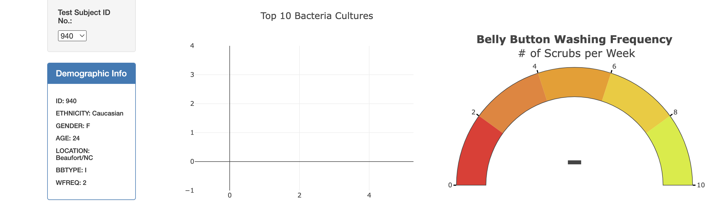
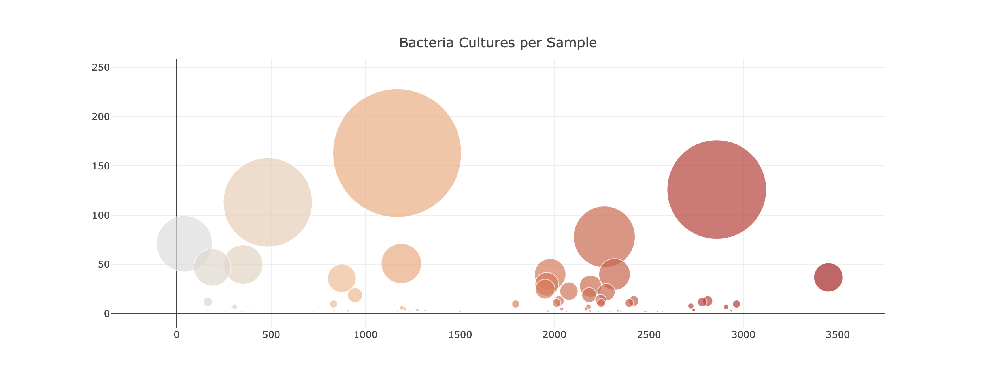

# plotly-belly-button-biodiversity

## Purpose

This project was completed to visualize bacterial data for each volunteer. Once the dashboard is finished, each volunteer's demographic information, the top ten bacteria living inside their belly button, frequency they wash their belly button, and bacteria cultures per sample will be visible on the website.

## Link to Website

[Belly Button Biodiversity](https://hrbaker18.github.io/plotly-belly-button-biodiversity/ "Interactive Dashboard")

## Overview of Dashboard

- A bar graph, gauge chart, and bubble chart were generated via Plotly to help volunteers identify the bacteria found in their belly buttons. 
